# React-Native prwodly-social App

react-native 0.64.2

  <kbd>
    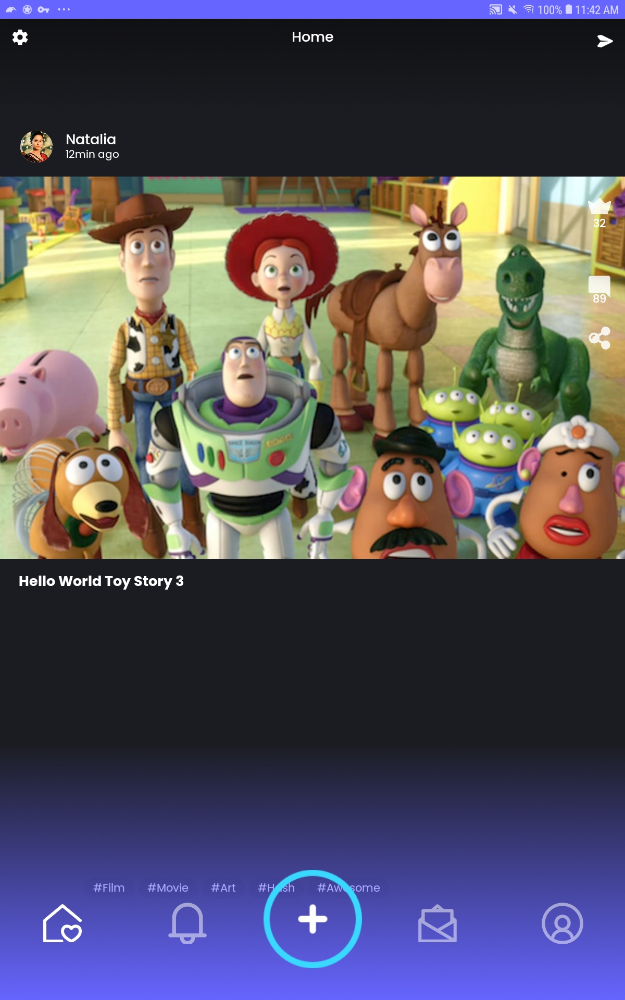
  </kbd>
  &nbsp;&nbsp;&nbsp;&nbsp;
  <kbd>
    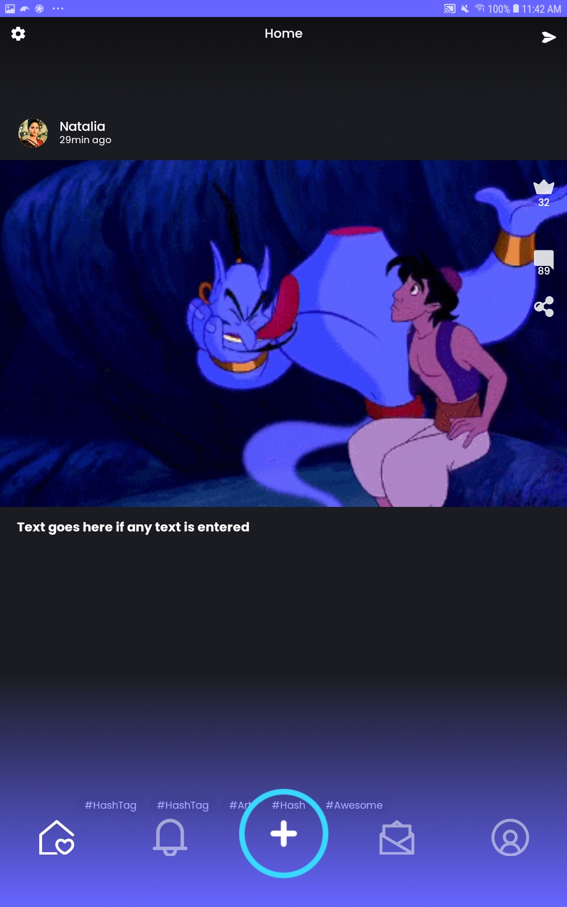
  </kbd>
  &nbsp;&nbsp;&nbsp;&nbsp;
  <kbd>
    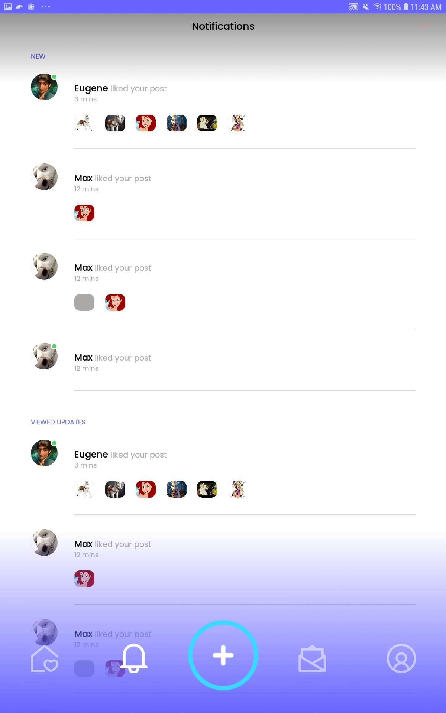
  </kbd>
    
  <kbd>
    
  </kbd>
    &nbsp;&nbsp;&nbsp;&nbsp;
  <kbd>
    
  </kbd>
    &nbsp;&nbsp;&nbsp;&nbsp;
  <kbd>
    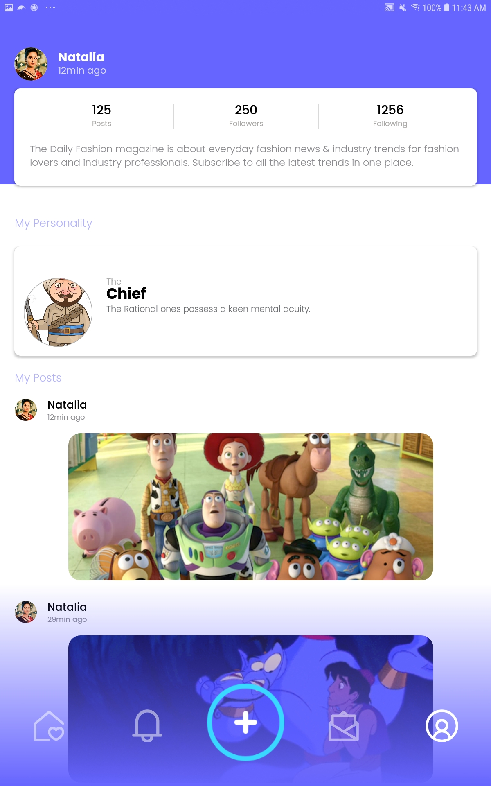
  </kbd>
     
   &nbsp;&nbsp;&nbsp;&nbsp;
  <kbd>
    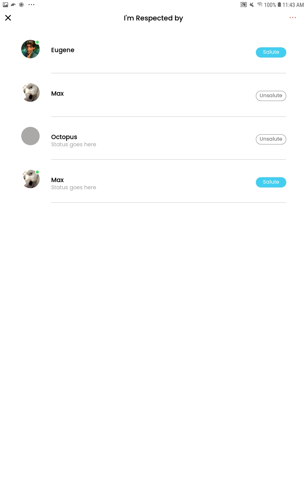
  </kbd>
  <kbd>
    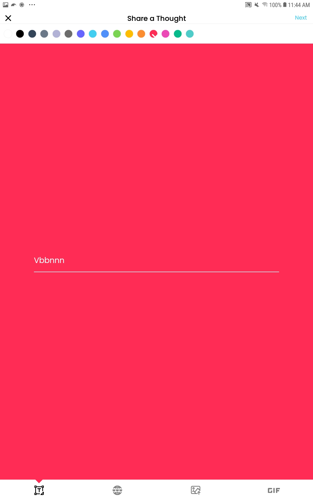
  </kbd>
  &nbsp;&nbsp;&nbsp;&nbsp;
  <kbd>
    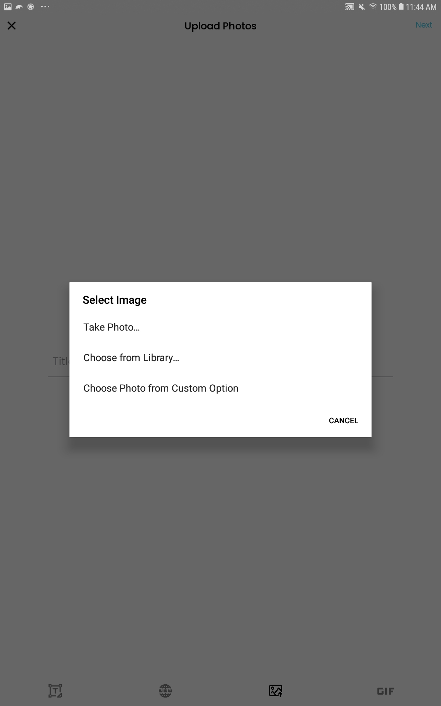
  </kbd>
  &nbsp;&nbsp;&nbsp;&nbsp;
  <kbd>
    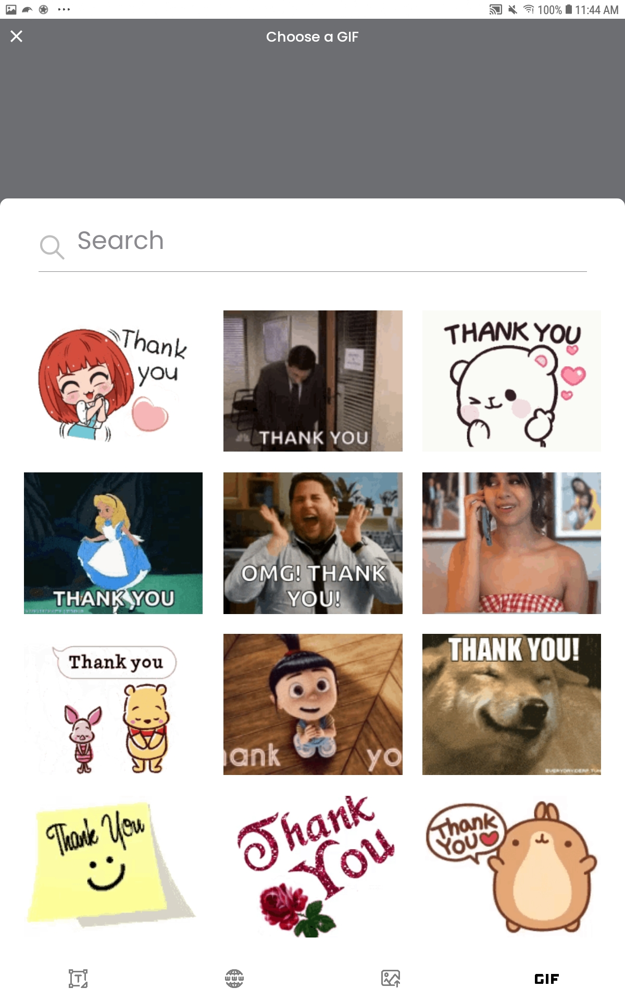
  </kbd>
    
  <kbd>
    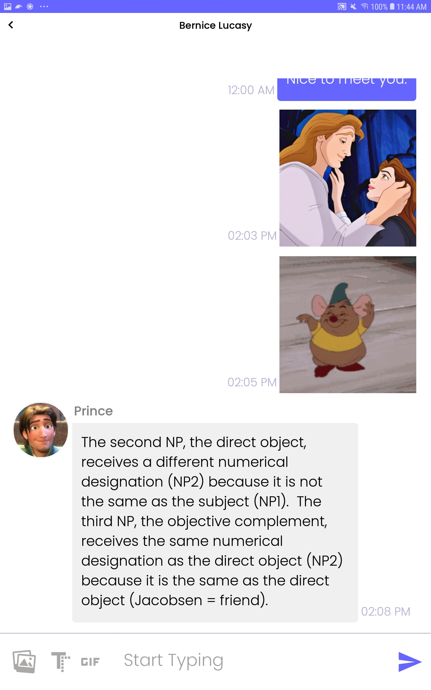
  </kbd>
    &nbsp;&nbsp;&nbsp;&nbsp;
  <kbd>
    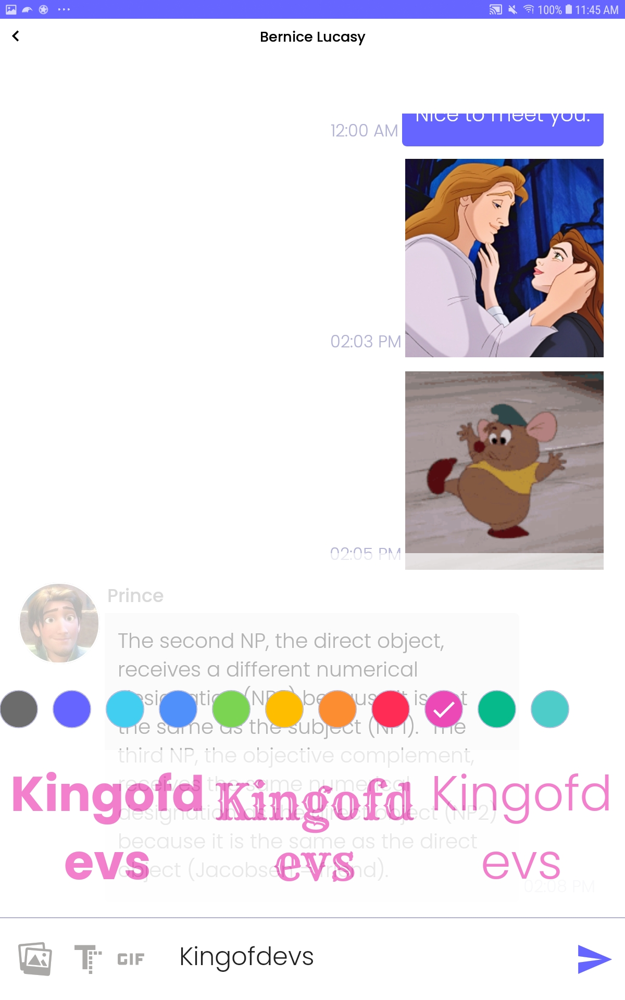
  </kbd>
    &nbsp;&nbsp;&nbsp;&nbsp;
  <kbd>
    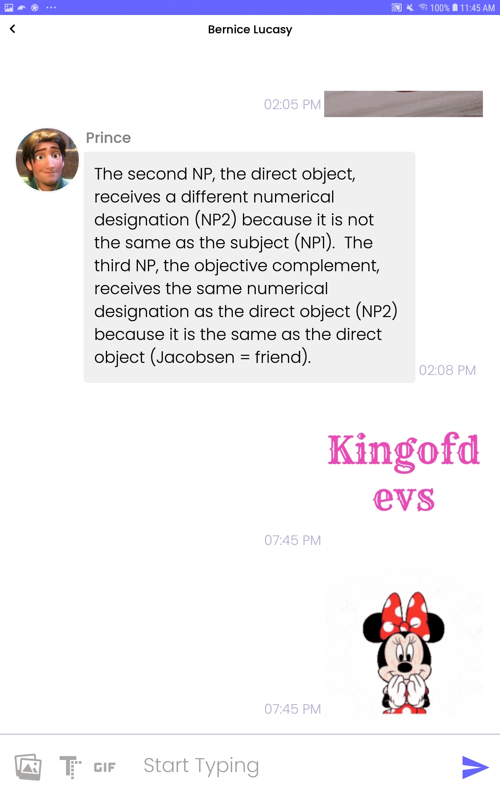
  </kbd>

